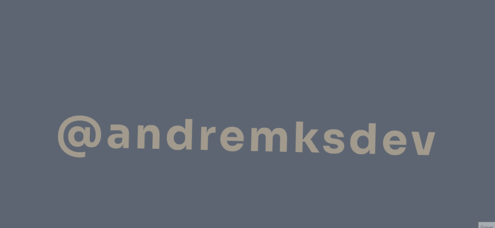

<h1 align="center">Welcome 👋 - #30diasDeCSS </h1>

 <a href="#sobre">Sobre</a> •
 <a href="#objetivo">Objetivo</a> •
 <a href="#regra">Regras Gerais</a> •
 <a href="#projeto">Projeto Desafio</a> •
 <a href="#referencia">Referências</a> •
 <a href="#desafio">Desafios</a>

<h3 id="sobre"><strong>📝 Sobre</strong></h3>

30 dias de CSS3, é um desafio que visa ajudá-lo a melhorar suas habilidades de codificação fazendo mini projetos diarios utilizando HTML5 e CSS3

 

<h3 id="objetivo"><strong>🚀 Objetivo</strong></h3>

30 dias de CSS3 é um desafio que visa melhorar minhas habilidades em HTML5 e CSS3 através da realização de pequenos projetos. A ideia é todo dia aplicar o conhecimento no qual venho adqirindo através de cursos voltados para o desenvolvimento Front-end. Ao fim desses 30 dias desejo aprender novas aplicações e abordagens diversas no HTML5 e CSS3.

 

<h3 id="regra"><strong>⚠ Regras Gerais</strong></h3>

- Realizar um projeto por dia
- Compartilhar o progresso nas mídias sociais (Twitter, Facebook, Linkedin etc.) usando a hashtag #30diasDeCSS
- O projeto deve ser concluído até 23:59h

 

<h3 id="projeto"><strong>🗂 Projeto Desafio</strong></h3>

Gostou da ideia?
[Clique aqui](https://github.com/MilenaCarecho/30diasDeCSS) para conhecer esse projeto de desafios criado pela [@milenacarecho](https://github.com/MilenaCarecho)

 

<h3 id="referencia"><strong>📹 Referências</strong></h3>

### Youtube Referências dos desafios

[Online Tutorials](https://www.youtube.com/channel/UCbwXnUipZsLfUckBPsC7Jog) -
[Creative Creations](https://www.youtube.com/channel/UCOKmVksbzoKJKmtu7rlEM1A) -
[DarkCode](https://www.youtube.com/channel/UCD3KVjbb7aq2OiOffuungzw)

 

<h3 id="desafio"><strong>🎯 Desafios</strong></h3>

- [Dia 01 - Ícone de mídia social em camadas](#id01)
- [Dia 02 - Loader animado](#id02)
- [Dia 03 - Mudar a cor do texto](#id03)
- [Dia 04 - Efeito em botão](#id04)
- [Dia 05 - Efeito pulsar](#id05)
- [Dia 06 - Efeito Lightning Text](#id06)
- [Dia 07 - Pre Loader com animação](#id07)
- [Dia 08 - Coração com animação](#id08)
- [Dia 09 - Pêndulo de Newton](#id09)
- [Dia 10 - Texto de digitação animado](#id10)
- [Dia 11 - Botão com efeito hover](#id11)
- [Dia 12 - Texto com efeito mouseover](#id12)
- [Dia 13 - Loading com efeito](#id13)
- [Dia 14 - Texto animado com efeito no Background](#id14)
- [Dia 15 - Texto com efeito flutuante](#id15)
- [Dia 16 - Botão com efeito](#id16)
- [Dia 17 - Loaer animado](#id17)
- [Dia 18 - Texto com efeito fumaça](#id18)

 

### Desafio dia 01 - Ícone de mídia social em camadas 

[Meu código](https://github.com/andremksdev/30diasDeCSS-Challenge/tree/main/Desafios/dia-01)

[Post LinkedIn](https://www.linkedin.com/posts/andremksdev_30diasdecss-html-css-activity-6872239398147129344-KruK)

[Post Twitter](https://twitter.com/andremksdev/status/1466475017739419662?s=20)

#### O que eu aprendi

- _Criar as camadas utilizando a tag ``_
- _Uso de um Bootstrap [aqui](https://www.bootstrapcdn.com/fontawesome/)_
- _Tranformação 2D ou 3D de um elemento [aqui](https://www.w3schools.com/cssref/css3_pr_transform.asp)_
- _[Transições CSS](https://developer.mozilla.org/pt-BR/docs/Web/CSS/CSS_Transitions/Using_CSS_transitions)_
- _[Opacidade / transparência do CSS](https://developer.mozilla.org/pt-BR/docs/Web/CSS/opacity)_
- _[hover](https://developer.mozilla.org/pt-BR/docs/Web/CSS/:hover)_
- _[nth-child ()](https://developer.mozilla.org/pt-BR/docs/Web/CSS/:nth-child)_

 

### Desafio dia 02 - Loader animado 

[Meu código](https://github.com/andremksdev/30diasDeCSS-Challenge/tree/main/Desafios/dia-02)

[Post LinkedIn](https://www.linkedin.com/posts/andremksdev_30diasdecss-challengecss-30diasdecss-activity-6872549412548161536-ZaPD)

[Post Twitter](https://twitter.com/andremksdev/status/1466790064277659655?s=20)

#### O que eu aprendi

- _Animação [@keyframes](https://developer.mozilla.org/pt-BR/docs/Web/CSS/@keyframes)_
- _Aplicação do [:before](https://developer.mozilla.org/pt-BR/docs/Web/CSS/::before)_
- _Movimentação de objetos através do TOP e LEFT em conjunto com o position_

 

### Desafio dia 03 - Mudar a cor do texto 

[Meu código](https://github.com/andremksdev/30diasDeCSS-Challenge/tree/main/Desafios/dia-03)

[Post LinkedIn](https://www.linkedin.com/posts/andremksdev_30diasdecss-challengecss-30diasdecss-activity-6872973929447731200-OxWw)

[Post Twitter](https://twitter.com/andremksdev/status/1467209035267125266?s=20)

#### O que eu aprendi

- _Animação [@keyframes](https://developer.mozilla.org/pt-BR/docs/Web/CSS/@keyframes)_
- _Uso do [white-space](https://developer.mozilla.org/pt-BR/docs/Web/CSS/white-space)_

 

### Desafio dia 04 - Efeito em botão 

[Meu código](https://github.com/andremksdev/30diasDeCSS-Challenge/tree/main/Desafios/dia-04)

[Post LinkedIn](https://www.linkedin.com/posts/andremksdev_30diasdecss-challengecss-30diasdecss-activity-6873269464280915968-Z4ms)

[Post Twitter](https://twitter.com/andremksdev/status/1467504688039972864?s=20)

#### O que eu aprendi

- _[:hover](https://www.w3schools.com/cssref/sel_hover.asp)_
- _[::before](https://www.w3schools.com/cssref/sel_before.asp)_
- _[::after](https://www.w3schools.com/cssref/sel_after.asp)_
- _[Transições](https://www.w3schools.com/css/css3_transitions.asp)_
- _[Transformação](https://www.w3schools.com/cssref/css3_pr_transform.asp)_

 

### Desafio dia 05 - Efeito pulsar 

[Meu código](https://github.com/andremksdev/30diasDeCSS-Challenge/tree/main/Desafios/dia-05)

[Post LinkedIn](https://www.linkedin.com/posts/andremksdev_30diasdecss-challengecss-30diasdecss-activity-6873624809486467072-mFJ0)

[Post Twitter](https://twitter.com/andremksdev/status/1467859533435449348?s=20)

#### O que eu aprendi

- _Animação [@keyframes](https://developer.mozilla.org/pt-BR/docs/Web/CSS/@keyframes)_
- _[Transformação](https://www.w3schools.com/cssref/css3_pr_transform.asp)_

 

### Desafio dia 06 - Efeito Lightning Text 

[Meu código](https://github.com/andremksdev/30diasDeCSS-Challenge/tree/main/Desafios/dia-06)

[Post LinkedIn](https://www.linkedin.com/posts/andremksdev_30diasdecss-challengecss-30diasdecss-activity-6873977966834012160-pfpn)

[Post Twitter](https://twitter.com/andremksdev/status/1468212426277588998?s=20)

#### O que eu aprendi

- _Animação [@keyframes](https://developer.mozilla.org/pt-BR/docs/Web/CSS/@keyframes)_
- _[nth-child ()](https://developer.mozilla.org/pt-BR/docs/Web/CSS/:nth-child)_

 

### Desafio dia 07 - Loader com animação 

[Meu código](https://github.com/andremksdev/30diasDeCSS-Challenge/tree/main/Desafios/dia-07)

[Post LinkedIn](https://www.linkedin.com/posts/andremksdev_30diasdecss-challengecss-30diasdecss-activity-6874310372262739968-4jP5)

[Post Twitter](https://twitter.com/andremksdev/status/1468545127266369544?s=20)

#### O que eu aprendi

- _Animação [@keyframes](https://developer.mozilla.org/pt-BR/docs/Web/CSS/@keyframes)_
- _[nth-child ()](https://developer.mozilla.org/pt-BR/docs/Web/CSS/:nth-child)_

 

### Desafio dia 08 - Coração com animação 

[Meu código](https://github.com/andremksdev/30diasDeCSS-Challenge/tree/main/Desafios/dia-08)

[Post LinkedIn](https://www.linkedin.com/posts/andremksdev_30diasdecss-css-challengecss-activity-6874757624542318592--2xu)

[Post Twitter](https://twitter.com/andremksdev/status/1468992339582623753?s=20)

#### O que eu aprendi

- _Animação [@keyframes](https://developer.mozilla.org/pt-BR/docs/Web/CSS/@keyframes)_
- _[::before](https://www.w3schools.com/cssref/sel_before.asp)_
- _[::after](https://www.w3schools.com/cssref/sel_after.asp)_

 

### Desafio dia 09 - Pêndulo de Newton 

[Meu código](https://github.com/andremksdev/30diasDeCSS-Challenge/tree/main/Desafios/dia-09)

[Post LinkedIn](https://www.linkedin.com/posts/andremksdev_30diasdecss-css-30diasdecss-activity-6875073591608795137-_o_v)

[Post Twitter](https://twitter.com/andremksdev/status/1469308633284493318?s=20)

#### O que eu aprendi

- _[::before](https://www.w3schools.com/cssref/sel_before.asp)_
- _[::after](https://www.w3schools.com/cssref/sel_after.asp)_
- _[first-child](https://www.w3schools.com/cssref/sel_firstchild.asp)_
- _[last-child](https://www.w3schools.com/cssref/sel_last-child.asp)_
- _[animations](https://www.w3schools.com/css/css3_animations.asp)_

 

### Desafio dia 10 - Texto de digitação animado 

[Meu código](https://github.com/andremksdev/30diasDeCSS-Challenge/tree/main/Desafios/dia-10)

[Post LinkedIn](https://www.linkedin.com/posts/andremksdev_30diasdecss-30diasdecss-frontend-activity-6875458593454333952-g-UA)

[Post Twitter](https://twitter.com/andremksdev/status/1469693251846385669?s=20)

#### O que eu aprendi

- _[::after](https://www.w3schools.com/cssref/sel_after.asp)_
- _[first-child](https://www.w3schools.com/cssref/sel_firstchild.asp)_
- _[last-child](https://www.w3schools.com/cssref/sel_last-child.asp)_
- _Animação [@keyframes](https://developer.mozilla.org/pt-BR/docs/Web/CSS/@keyframes)_

 

### Desafio dia 11 - Botão com efeito Hover 

[Meu código](https://github.com/andremksdev/30diasDeCSS-Challenge/tree/main/Desafios/dia-11)

[Post LinkedIn](https://www.linkedin.com/posts/andremksdev_30diasdecss-frontend-html-activity-6875843678729068544-SFne)

[Post Twitter](https://twitter.com/andremksdev/status/1470078313888632840?s=20)

#### O que eu aprendi

- _[::before](https://www.w3schools.com/cssref/sel_before.asp)_
- _[:hover](https://www.w3schools.com/cssref/sel_hover.asp)_

 

### Desafio dia 12 - Texto com efeito mouseover 

[Meu código](https://github.com/andremksdev/30diasDeCSS-Challenge/tree/main/Desafios/dia-12)

[Post LinkedIn](https://www.linkedin.com/posts/andremksdev_30diasdecss-frontend-html-activity-6876162964144046080-hjv8)

[Post Twitter](https://twitter.com/andremksdev/status/1470414812286967809?s=20)

#### O que eu aprendi

- _[data-attributes](https://www.w3schools.com/cssref/sel_hover.asp)_
- _[::before](https://www.w3schools.com/cssref/sel_before.asp)_
- _[:hover](https://www.w3schools.com/cssref/sel_hover.asp)_

 

### Desafio dia 13 - Loading com efeito 

[Meu código](https://github.com/andremksdev/30diasDeCSS-Challenge/tree/main/Desafios/dia-13)

[Post LinkedIn](https://www.linkedin.com/posts/andremksdev_30diasdecss-frontend-html-activity-6876520295205883904-mcwV)

[Post Twitter](https://twitter.com/andremksdev/status/1470755532566929410?s=20)

#### O que eu aprendi

- _[data-attributes](https://www.w3schools.com/cssref/sel_hover.asp)_
- _[::before](https://www.w3schools.com/cssref/sel_before.asp)_
- _Animação [@keyframes](https://developer.mozilla.org/pt-BR/docs/Web/CSS/@keyframes)_

 

### Desafio dia 14 - Texto animado com efeito no Background 

[Meu código](https://github.com/andremksdev/30diasDeCSS-Challenge/tree/main/Desafios/dia-14)

[Post LinkedIn](https://www.linkedin.com/posts/andremksdev_30diasdecss-frontend-html-activity-6876878857144803328-yXuk)

[Post Twitter](https://twitter.com/andremksdev/status/1471114867004350469?s=20)

#### O que eu aprendi

- _[-webkit-background-clip](https://developer.mozilla.org/en-US/docs/Web/CSS/background-clip)_
- _[-webkit-text-fill-color](https://developer.mozilla.org/en-US/docs/Web/CSS/-webkit-text-fill-color)_
- _[-webkit-text-stroke](https://developer.mozilla.org/en-US/docs/Web/CSS/-webkit-text-stroke)_
- _Animação [@keyframes](https://developer.mozilla.org/pt-BR/docs/Web/CSS/@keyframes)_

 

### Desafio dia 15 - Texto com efeito flutuando 

[Meu código](https://github.com/andremksdev/30diasDeCSS-Challenge/tree/main/Desafios/dia-15)

[Post LinkedIn](https://www.linkedin.com/posts/andremksdev_30diasdecss-frontend-html-activity-6877254149478617089-YqBl)

[Post Twitter](https://twitter.com/andremksdev/status/1471489047960850439?s=20)

#### O que eu aprendi

- _[::before](https://www.w3schools.com/cssref/sel_before.asp)_
- _Animação [@keyframes](https://developer.mozilla.org/pt-BR/docs/Web/CSS/@keyframes)_

 

### Desafio dia 16 - Botão com efeito 

[Meu código](https://github.com/andremksdev/30diasDeCSS-Challenge/tree/main/Desafios/dia-16)

[Post LinkedIn](https://www.linkedin.com/posts/andremksdev_30diasdecss-frontend-html-activity-6877667331829440512-XteO)

[Post Twitter](https://twitter.com/andremksdev/status/1471902029685608449?s=20)

#### O que eu aprendi

- _[::before](https://www.w3schools.com/cssref/sel_before.asp)_
- _[:hover](https://www.w3schools.com/cssref/sel_hover.asp)_
- _[Transformação](https://www.w3schools.com/cssref/css3_pr_transform.asp)_

 

### Desafio dia 17 - Loader animado 

[Meu código](https://github.com/andremksdev/30diasDeCSS-Challenge/tree/main/Desafios/dia-17)

[Post LinkedIn](https://www.linkedin.com/posts/andremksdev_30diasdecss-frontend-html-activity-6877963257135546368-jYE_)

[Post Twitter](https://twitter.com/andremksdev/status/1472198280482377732?s=20)

#### O que eu aprendi

- _[::before](https://www.w3schools.com/cssref/sel_before.asp)_
- _[Transformação](https://www.w3schools.com/cssref/css3_pr_transform.asp)_

 

### Desafio dia 18 - Texto com efeito fumaça 

[Meu código](https://github.com/andremksdev/30diasDeCSS-Challenge/tree/main/Desafios/dia-18)

[Post LinkedIn](https://www.linkedin.com/posts/andremksdev_30diasdecss-frontend-html-activity-6878321407873294336-XhYO)

[Post Twitter](https://twitter.com/andremksdev/status/1472556005796024329?s=20)

#### O que eu aprendi

- _[nth-child ()](https://developer.mozilla.org/pt-BR/docs/Web/CSS/:nth-child)_
- _[:hover](https://www.w3schools.com/cssref/sel_hover.asp)_
- _[Transformação](https://www.w3schools.com/cssref/css3_pr_transform.asp)_
